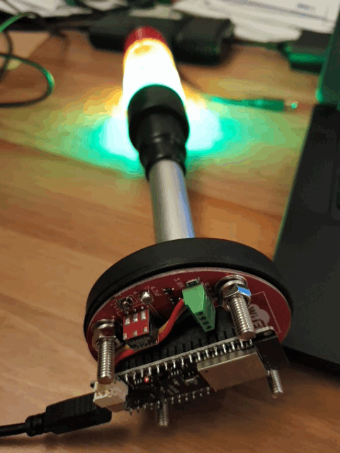
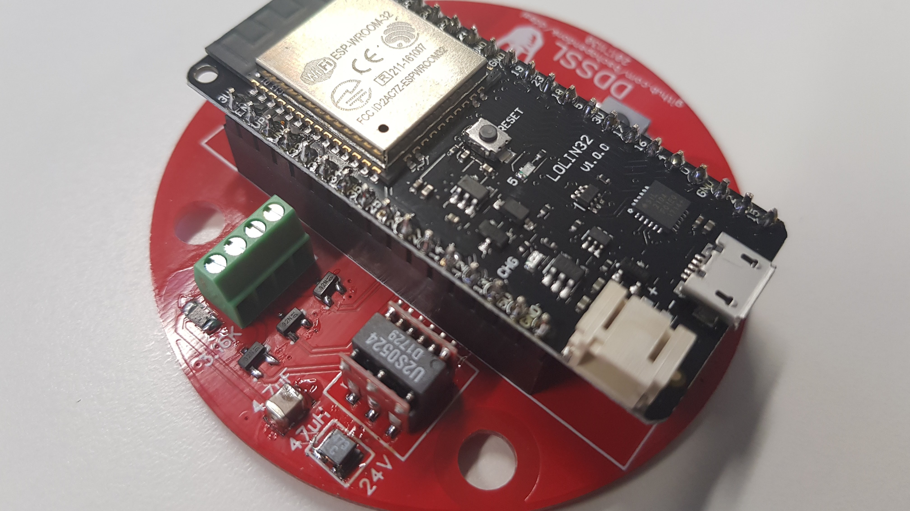
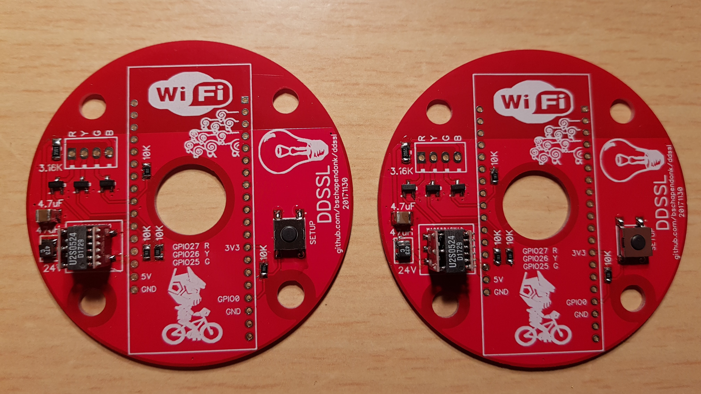
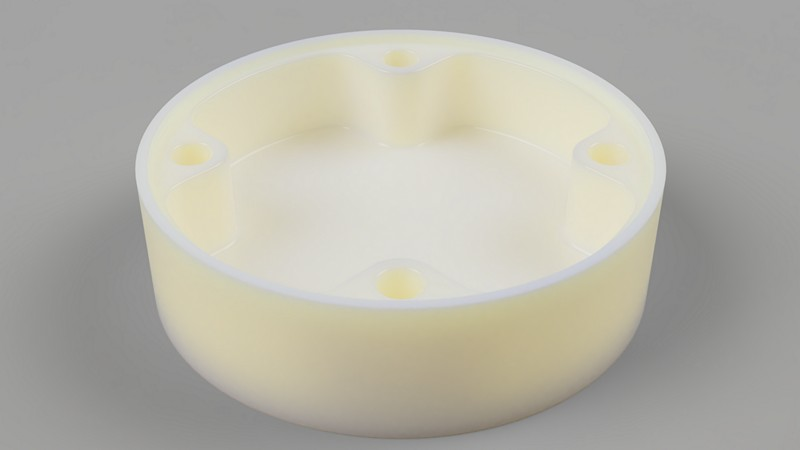

# DDSSL (Developer Desk Status Stack Light)

## ESP32 controlled Stacklight

* [Zipped](hardware/gerber/ddssl_20171130.zip) gerbers (30-11-2017)
* Mouser Electronics [Bill of Materials](hardware/bom.xls) (30-11-2017)
* Aqquired from AliExpress
    * Stacklight assembly [HBJD-40D/3/RYG/24V/B](https://www.aliexpress.com/item/ONPOW-40mm-Warning-Light-Red-Yellow-Green-Continous-LED-Light-Indicator-Signal-Tower-Light-DC24V-HBJD/32718843984.html)
    * ESP32 [LOLIN32](https://www.aliexpress.com/item/10Pin-Convert-To-Standard-6-Pin-Adapter-Board-For-ATMEL-STK500-AVRISP-USBASP/1859124621.html)

## TODO

* Housing
* Software

